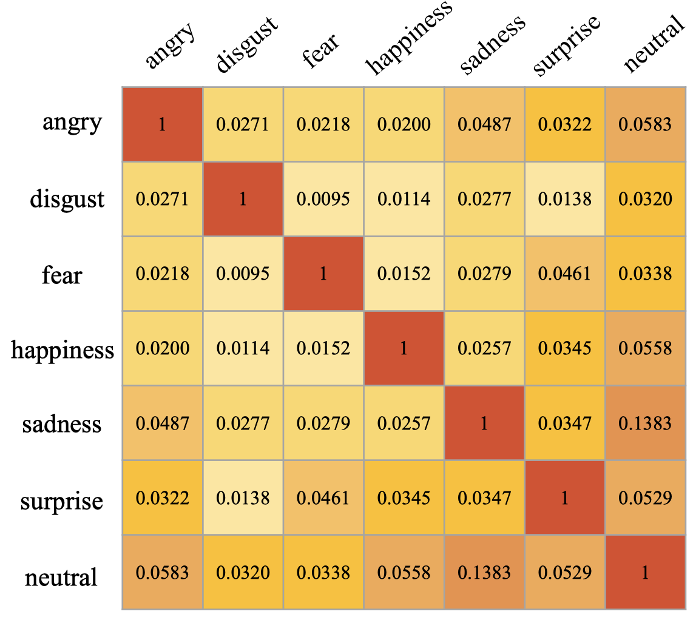
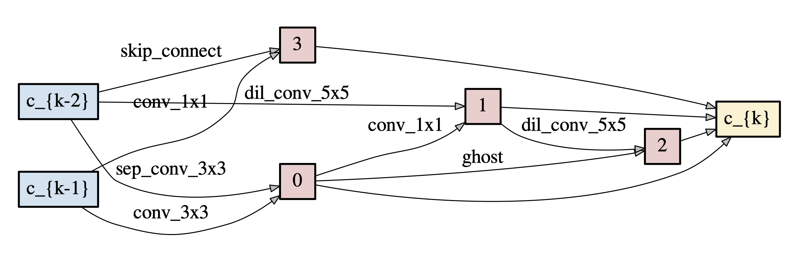
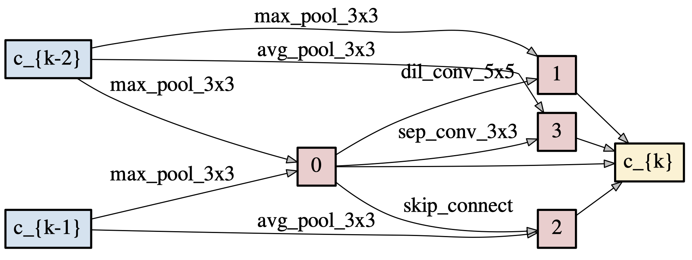

# Auto-FERNet
Deep convolutional neural networks have achieved great success in facial expression datasets both under laboratory conditions and in the wild. However, most of these related researches use general image classification networks (e.g., VGG, GoogLeNet) as backbones, which leads to inadaptability while applying to Facial Expression Recognition (FER) task, especially those in the wild. In the meantime, these manually designed networks usually have large parameter size. To tackle with these problems, we propose an appropriative and lightweight Facial Expression Recognition Network Auto-FERNet, which is automatically searched by a differentiable Neural Architecture Search (NAS) model directly on FER dataset. Furthermore, for FER datasets in the wild, we design a simple yet effective relabeling method based on Facial Expression Similarity (FES) to alleviate the uncertainty problem caused by natural factors and the subjectivity of annotators. Experiments have shown the effectiveness of the searched Auto-FERNet on FER task. Concretely, our architecture achieves a test accuracy of 73.78% on FER2013 without ensemble or extra training data. And noteworthily, experimental results on CK+ and JAFFE outperform the state-of-the-art with an accuracy of 98.89% (10 folds) and 97.14%, respectively, which also validate the robustness of our system.

Pipeline of Auto-FERNet | Facial Expression Similarity (FES) Matrix
---|---


This is an implementation of the paper ["Auto-FERNet: A Facial Expression Recognition Network With Architecture Search"](https://ieeexplore.ieee.org/abstract/document/9442348).


## Requirements
To run this code, please install:
```
pytorch=1.4.0, torchvision=10.0, Pillow=6.1
```


## Architecture Search
Neural architecture search on _FER2013_ based on [SGAS](https://arxiv.org/abs/1912.00195). To search the best architecture:
```bash
python search.py --batch_size 24 --batch_increase 8 --learning_rate 0.025
```

## Retraining on _FER2013_
To train the searched architecture from scratch:
```bash
python train_FER2013.py --arch  --batch_size 24 --learning_rate 0.025 --layers 12 --auxiliary_weight 0.4
```


## Relabel Training
To conduct a relabel training for better performance:
```bash
python relabel_training.py --batch_size 64 --learning_rate 0.001 --relabel_threshold 0.2 --fes True --fes_threshold 0.03 --checkpoint checkpoint
```
Note that the loaded models are, ideally, the ones saved before totally converged, such as when the training accuracy reaches _85%_ or _90%_. 

The relabeling can be divided into two strategies:
+ The original relabeling based only on the softmax vector.
+ The relabeling based on Facial Expression Similarity (FES).


## Ensemble
To get an average inference from different models on FER2013. You can customize your ensemble models in the array of `model_names` and `--layers` and run:
```bash
python ensemble.py --models --batch_size 64
```

## Finetune on _CK48_ and _JAFFE_
After retraining on _FER2013_, you can fine-tune the saved model on _CK48_ and _JAFFE_ by running:
```bash
python train_CK48.py --batch_size 64 --learning_rate 0.01 --checkpoint checkpoint 
```
```bash
python train_JAFFE.py --batch_size 16 --learning_rate 0.01 --checkpoint checkpoint 
```

## Results
|Benchmark|Params(MB)|Top-1 Accuracy (%)|
|:-----:|:-----:|:-----:|
|FER2013|2.1|73.78|
|CK48|2.1|99.37|
|JAFFE|2.1|97.14|

Normal Cell | Reduction Cell
---|---


## Citation
```
@article{li2021fernet,
  title={Auto-FERNet: A Facial Expression Recognition Network With Architecture Search},
  author={Li, Shiqian and Li, Wei and Wen, Shiping and Shi, Kaibo and Yang, Yin and Zhou, Pan and Huang, Tingwen},
  journal={IEEE Transactions on Network Science and Engineering},
  year={2021},
  pages={2213-2222}
}
```

## Contact
Further information and details please contact [Li Wei](liwei9719@126.com) and [Li Shiqian](lishiqian2001@gmail.com).
